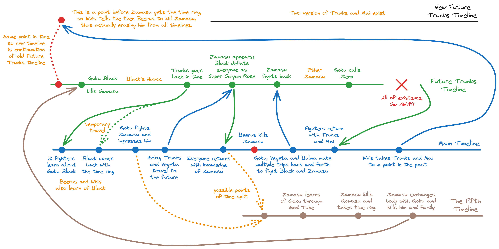

## Whats and Whys

I did a similar writeup on Dragon Ball Z's Cell saga timeline [earlier](https://tanishq.page/blog/posts/dbz-cell-timeline/). Just like in Z, Super also had a saga involving Future Trunks and, therefore, another time travel mystery. An in-depth understanding of this timeline isn't necessary to enjoy the story. Like Z, many people feel there are only two timelines in the Zamasu saga of Dragon Ball Super. I'll present my theories on how this is a quad-timeline story and how a 5th timeline came into existence.

A very brief recap of the Zamasu saga &rarr;

> [!INFO]
> Future Trunks goes back in time because Goku Black is terrorizing his world. Black somehow follows back and fights Goku. Beerus and Whis thought the energy was similar to Zamasu from Universe 10. When Goku, Vegeta, and Trunks go to the future, Black achieves Super Saiyan Rose and is stronger than all Z fighters. With this knowledge, they head back to the present, where Beerus deals with a scheming Zamasu; however, that godly act didn't erase the future Zamasu because he wore a time ring. After multiple back and forths in the time machine, Zamasu is partially defeated and becomes an ether to be destroyed by Zeno. Whis then takes Trunks and Mai back to their past and fixes everything by talking to the then Beerus, and Trunks and Mai live with another version of them.

## Concepts & Explanations

### Concepts of Time

All of the concepts of time from the Dragon Ball Z blog still hold. However, one of the rules is of significant importance. We established that when a time traveler goes back the first time, it causes a split in the timeline, after which the traveler can travel back and forth without further changes unless another time traveler is involved.

The thing to note here is that while Trunks can travel freely between his timeline and the show's (the one we watch) timeline, if any or several of the Z fighters go back with Trunks, that's considered a new traveler. However, if the new traveler shares context with the old traveler, the timeline of the new traveler is affected because he's the one gaining otherwise foreign context. So, when Goku, Vegeta, and Bulma travel to the future with Trunks and return, they are the ones with new context, which results in a split.

While such a split does happen, it doesn't need to occur at the point when the traveler travels back. It could also occur at a point earlier than that, where the normal flow of time would end up resulting in the traveler infringing with time. We'll revisit this through a flow chart.

### The Timelines of the Zamasu Saga

This diagram represents time as a sequence of events for each of the timelines created during the Zamasu saga. The main timeline and the Future Trunks timeline are continuations of their named counterparts from the [Cell Timeline blog post](https://tanishq.page/blog/posts/dbz-cell-timeline/).

Legend &rarr;

- *Main Timeline* &rarr; Shown in blue; this is the timeline that we follow in the show, which goes on to the Tournament of Power.
- *Future Trunks Timeline* &rarr; Shown in green; this is where the actual future Trunks is from, the one where Goku Black first appears.
- *New Future Trunks Timeline* &rarr; Shown in black; this is where two versions of Trunks and Mai exist after Whis fixes their timeline by traveling through time.
- *The Fifth Timeline* &rarr; Shown in brown; this is the timeline that was created as a result of either Black showing up in the main timeline, Goku and Vegeta returning with context about Black and Zamasu being partners, or Beerus destroying the main timeline's Zamasu. The consequence of each of these actions is the same as far as time is concerned, so it's more important to note that a split happened rather than when the split happened. Based on the story provided by the Anime, it's hard to pinpoint this exact moment. Thankfully, that doesn't present itself as a plothole and still fits well with the rest of the theory.

The red artifacts are all acts of Gods. The orange text explains situations.

### Special Events Explanation

For simplicity's sake, we'll refer to the Zamasu that becomes Goku Black as Black, even before he becomes Black. On that note, the following is the explanation of some of the important events across all the timelines &rarr;

- When Trunks returned to the main timeline, Black was already wearing the time ring. The time ring reacted to the space from which the time machine vanished. While the time ring can only be used to travel to the future and back again, it could be that the time machine allowed the time ring to follow it into its "future" (the time machine's future would be the past or the main timeline). That's why even though Black made it to the main timeline, time automatically started correcting itself, which is why it pulled Black back into the timeline he traveled from.
- Beerus killing the main timeline's Zamasu, Goku fighting Zamasu, or the return of Z fighters from the Future Trunks timeline; any of these events could have caused a split of the main timeline. It could also be the temporary trip of Black from the Future Trunks timeline to the main timeline. However, it is most likely that when Goku and Vegeta traveled back from Future Trunks timeline, they gained additional context to affect their timeline (it was after this when Beerus and Whis went to monitor and stop the death of Gowasu and destroy Zamasu).
- Black got Goku's body using the Super Dragon Balls from the timeline that resulted from the previously mentioned split because Beerus does not destroy Black (Zamasu). This Black travels to the Future Trunks timeline using one of the 4 time rings formed due to Bulma's time machine during the Cell saga. My guess is that this timeline was partially randonly chosen. Partially because - time rings can take to the future, so Black probably also checked the main timeline and found that his counterpart was not alive there. However, he was alive in the Future Trunks timeline because Goku was already dead before meeting Zamasu. Black kills the Gowasu from the Future Trunks timeline, recruits Zamasu, and uses Super Dragon Balls to make him immortal.
- Zeno destroyed the Future Trunks timeline after ether-Zamasu was formed. Trunks and Mai returned with the Z fighters to the main timeline. This is also a special event, as Mai's tag-along doesn't cause a split because nothing she offered was new to the main timeline.
- Whis takes Trunks and Mai to a point in the Future Trunks timeline before Black kills Gowasu and asks Beerus to destroy the then Zamasu. Then, no other Zamasu in other timelines had a time ring to protect him, so this caused all the Zamasu to be destroyed, as initially claimed by Beerus.

## Something to Notice; Fin

When the arc ends, the main timeline's Gowasu places 5 time rings (those associated with splits) in the box and locks them away. However, we explored 2 new timelines apart from the 4 from Cell saga - the Fifth timeline and the New Future Trunks timeline. So what's the discrepancy?

The New Future Trunks timeline continues the old Future Trunks timeline. This should still be considered as the same timeline because Zeno destroyed that timeline, and Zeno is a complete wild card. It is possible he somehow destroyed the entire segment of Black, which erased everything up to the point when Whis takes Trunks and Mai. Zeno is the CREATOR! So, this is plausible. But in any case, when Gowasu places those rings in the box at the moment in the main timeline, the old Future Trunks timeline is the same as the New Future Trunks timeline. Therefore, the only new timeline is the Fifth timeline, where Black is originally from.

That's my complete interpretation of the time-related concepts from the Zamasu arc of Dragon Ball Super. Phew!
