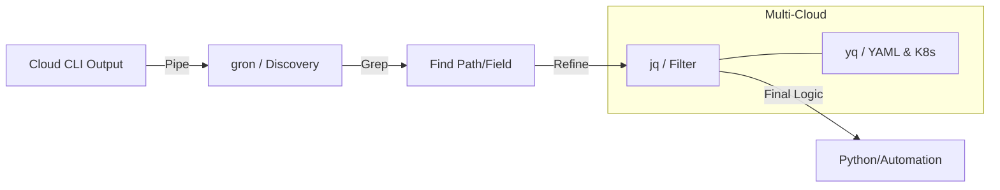

If you spend any amount of time in Cloud Security and analysis, you'll realize that a large part of is wrestling with massive, deeply nested JSON blobs. 

Whether you are auditing an AWS environment for privilege escalation or debugging a Kubernetes manifest, your speed is limited by your ability to parse data. For a while now, my "holy trinity" for this has been `jq`, `gron`, and `ripgrep`.

## The Discovery Workflow: gron + grep

The biggest hurdle with cloud CLI output (especially `aws-cli`) is not knowing the exact path to a field. When you're looking for an "unknown thing" in a 5,000-line JSON response, `jq` can be frustrating because it requires you to know the structure beforehand.

This is where `gron` shines. It transforms JSON into discrete, flat assignments.

> [!TIP]
> **Workflow:** Dump the JSON ➔ Pipe to `gron` ➔ `grep` for the keyword ➔ Use the path provided by `gron` to write your final `jq` filter.

```bash
# Finding where a specific VPC ID is mentioned in a massive describe-ec2 dump
aws ec2 describe-instances | gron | grep "vpc-0abc123"
```

Once you find the line—e.g., `json.Reservations[4].Instances[0].VpcId = "vpc-0abc123";`—you now have the exact path to plug into a script or a `jq` filter.

## The Surgeon's Scalpel: jq

While `gron` is for discovery, `jq` is for extraction and transformation. In security contexts, `jq` is indispensable for finding Privilege Escalation (PrivEsc) vectors.

### 5 Practical AWS Queries

Here are five ways I use these tools to cut through the noise:

| Use Case | Tool | Command / Logic |
| --- | --- | --- |
| **IAM PrivEsc** | `jq` | Find policies with `Action: "*"` on sensitive resources |
| **Compliance** | `jq` | Identify unencrypted EBS volumes or S3 buckets |
| **Inventory** | `jq` | Map Instance IDs to Private IPs for Ansible/SSH |
| **Discovery** | `gron` | Find "hidden" tags or values in nested structures |
| **K8s/YAML** | `yq` | Audit securityContext in Kubernetes manifests |

#### 1. Finding Over-Privileged IAM Policies (Security)

```bash
aws iam list-policies --scope Local | jq '.Policies[] | select(.AttachmentCount > 0) | .PolicyName'
```

#### 2. Identifying Unencrypted EBS Volumes

```bash
aws ec2 describe-volumes | jq '.Volumes[] | select(.Encrypted == false) | {ID: .VolumeId, Size: .Size}'
```

#### 3. Filtering S3 Buckets with Public Access

```bash
aws s3api list-buckets | jq -r '.Buckets[].Name' | xargs -I {} sh -c 'aws s3api get-public-access-block --bucket {} 2>/dev/null | jq --arg b "{}" ".PublicAccessBlockConfiguration | {Bucket: \$b, Status: .}"'
```

#### 4. Finding "Hidden" Configs with ungron

If you find a nested field you like, you can isolate it and turn it back into JSON:

```bash
aws ec2 describe-security-groups | gron | grep "0.0.0.0/0" | gron -ungron
```

#### 5. Mapping Instance IDs to IPs

```bash
aws ec2 describe-instances | jq -r '.Reservations[].Instances[] | "\(.InstanceId) \(.PrivateIpAddress)"'
```

## Data Exploration vs. Scripting

A common question is: "Why not just use Python?" While I eventually move complex logic into Python scripts, the CLI is king for the **Exploration Phase**.

Writing a Python script blindly against a Cloud API is a recipe for `KeyError` frustration.

1. **CLI Recon:** Use `gron` to map the unknown structure.
2. **Refinement:** Use `jq` to verify the filtering logic.
3. **Implementation:** Once you know the path, write your Python dictionary comprehension with 100% confidence.

> [!INFO]
> These tools are also life-savers for script debugging. Dump your script's raw JSON output to a file and run it through `gron` to spot where your dictionary structure is diverging from your expectations.

## Tooling Workflow



## Final Thoughts

Mastering `jq`, `gron`, and `yq` effectively turns your terminal into a powerful IDE for infrastructure. Whether you're on AWS, Azure, or GCP, the data is JSON—and if it's JSON, you can master it.

> [!DANGER]
> **Warning:** Always pipe your output to a pager like `less` when dealing with massive cloud environments to avoid flooding your buffer!
