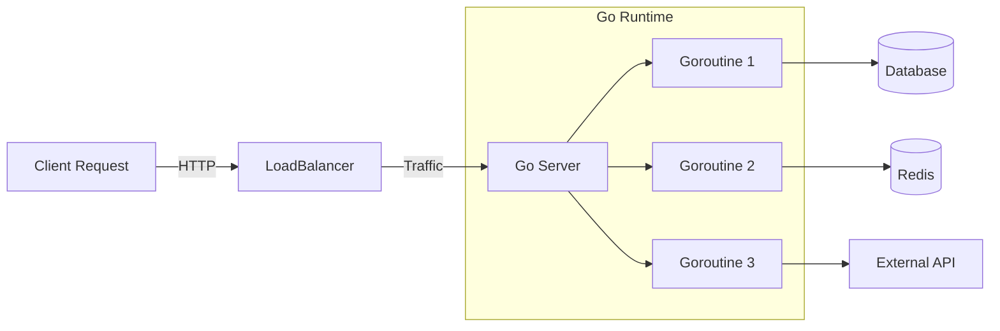

When I started exploring new programming languages and tooling, **Go** caught my attention for several compelling reasons suitable for security engineering. It's fast, statically typed, and compiles to a single binary.

## Fundamentals

Before getting anywhere, Go should be installed using the instructions specified in [Go Docs](https://go.dev/doc/install). It's very straightforward.

> [!TIP]
> **Pro Tip:** It's an amazing idea to use containers to run Go stuff. In my project `containerized-security-toolkit`, the default Go BIN path is `/root/go/bin/`.

## Getting Started

Go uses `go.mod` files for dependency tracking, which can be initialized using the `go mod init` command. For example:

```bash
# Initialize a new module
go mod init github.com/tanq16/go-learn
```

In Go, code is organized into packages, which also groups functions together from files in the same directory. A typical Go program starts with a `main` package and a `main` function.

```go
package main

import "fmt"

func main() {
    // Print a simple message
    fmt.Println("Etherios!")
}
```

This code can be run with `go run .` or compiled into a binary with `go build .`. To install the program as an executable in the default Go bin path, use `go install`.

## Why Go for Security?

Here is a quick comparison of why I prefer Go over Python for certain tools:

| Feature | Go | Python |
| :--- | :--- | :--- |
| **Speed** | Compiled, extremely fast | `Interpreted`, slower |
| **Concurrency** | Native Goroutines | ~Asyncio~ / Threading |
| **Distribution** | Single static binary | Requires Venv / Dependencies |
| **Type System** | Static (catch bugs early) | Dynamic |

> [!DANGER]
> **Warning:** While Go is memory safe, it does not prevent logic bugs. Always audit your code for business logic vulnerabilities!

## Architecture Diagram

Here is how a typical Go web server handles requests concurrently:



## Advanced Concepts

One of the most powerful features is **Interfaces**. They allow you to define behavior without specifying implementation.

> [!INFO]
> Go interfaces are satisfied implicitly. You don't need to use an `implements` keyword.

```go
type Attacker interface {
    Attack(target string) error
}

type NmapScanner struct {}

func (n NmapScanner) Attack(target string) error {
    // Implementation
    return nil
}
```

### Error Handling

Go treats errors as values. This forces developers to handle them explicitly.

```go
file, err := os.Open("config.yaml")
if err != nil {
    log.Fatal(err)
}
```
